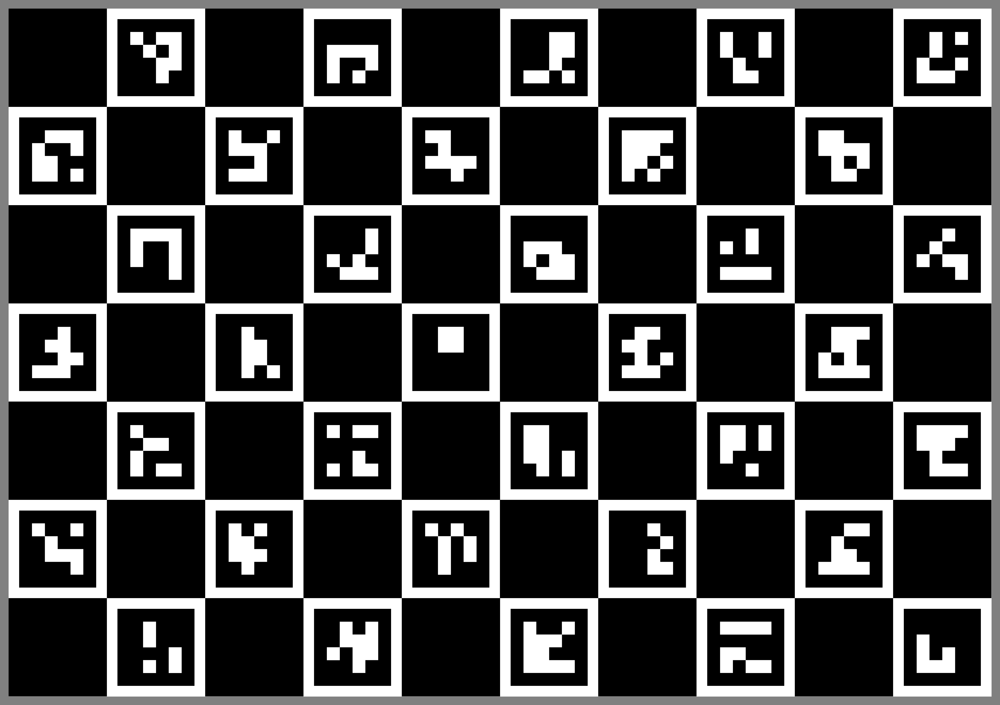
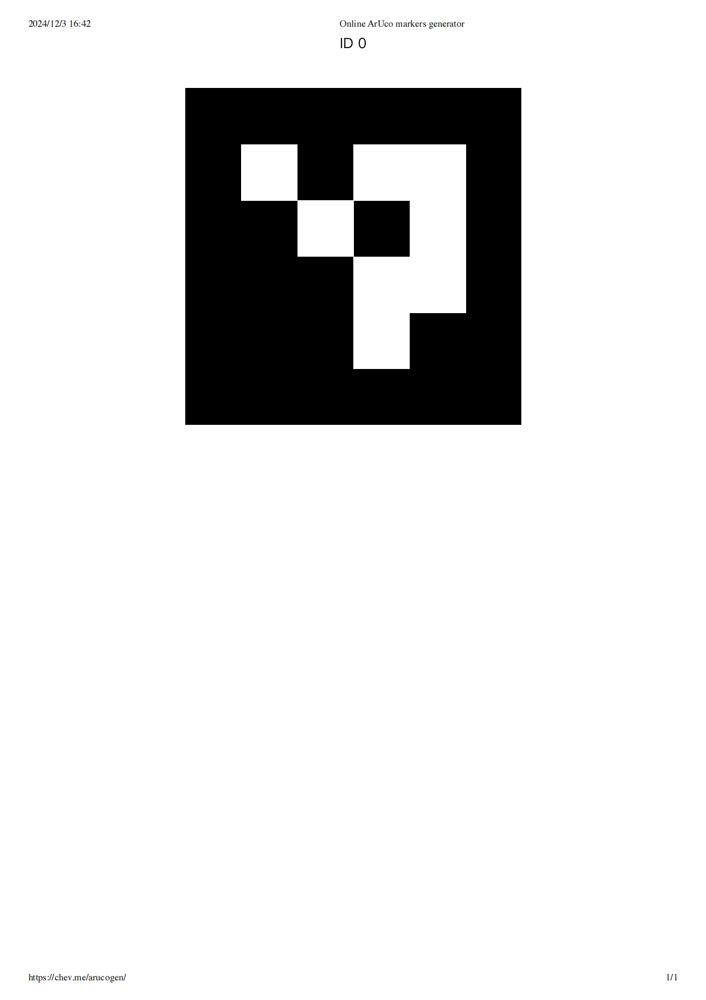
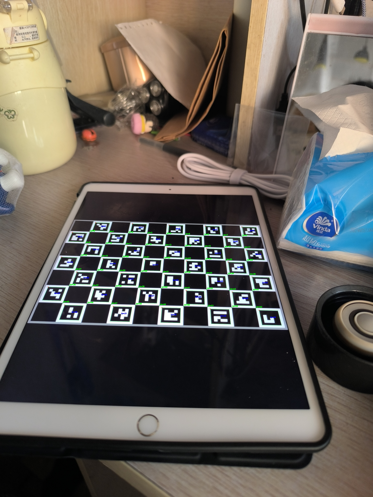
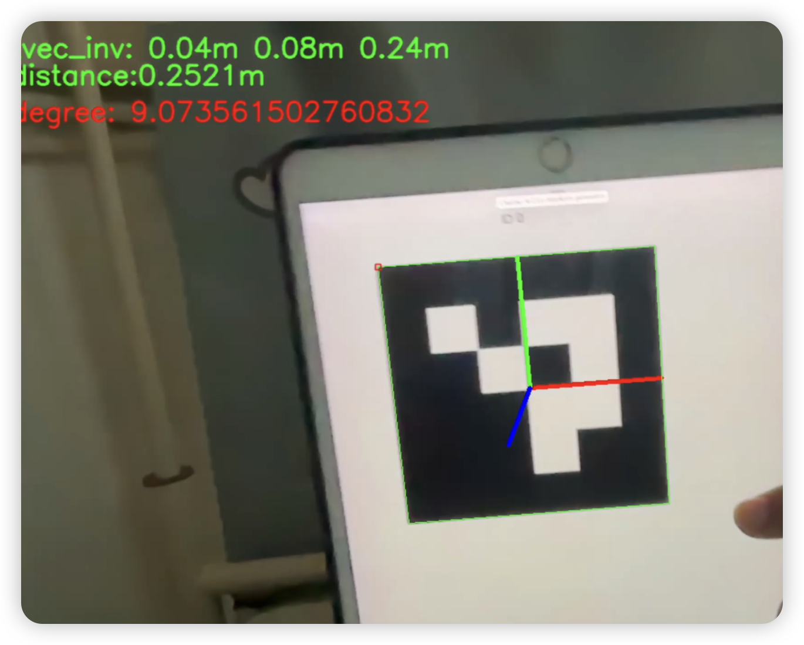

# Camera Alignment System (相机对齐系统)

这是一个基于 Flask 和 OpenCV 的相机对齐系统，主要用于实时相机画面与预设蒙版的对齐，并支持 ArUco 标记检测和相机标定功能。

## 功能特点

### 1. 相机对齐功能
- 实时视频流显示
- 多视角切换支持
- 可调节蒙版透明度
- 蒙版开关控制
- 实时对齐状态显示

### 2. ArUco 标记检测
- 支持多种 ArUco 字典类型
- 实时位姿估计
- 距离和角度计算
- 坐标轴可视化

### 3. 相机标定
- 支持 Charuco 板标定
- 自动保存标定参数
- 支持多图片批量标定
- 标定参数的 YAML 格式存储

## 技术栈

- **后端**：
  - Flask
  - OpenCV (cv2)
  - NumPy
  - Awkward Array
  
- **前端**：
  - HTML5
  - CSS3
  - Layui
  - JavaScript

## 项目结构

## 示例图片说明

### ArUco 标记示例
位于 `assert/images/` 目录：

1. **ArUco_full.png**
   
   - 完整的 ArUco 标记板示例
   - 用于相机标定和位姿估计
   - 包含多个 4x4 ArUco 码

2. **ArUco_single.png**
   
   - 单个 ArUco 标记示例
   - 用于基本的位置检测和跟踪
   - 展示了标准 4x4 ArUco 码格式

### 标定和检测结果
位于 `output/` 目录：

1. **01_output.jpg**
   - 相机标定过程的可视化结果
   - 显示检测到的 Charuco 角点
   - 包含坐标轴的叠加显示
   - 用于验证标定和检测的准确性

2. **calibration.yaml**
   - 存储相机标定参数
   - 包含相机矩阵和畸变系数
   - 用于后续的位姿估计

### 使用示例

1. **标定过程，获取相机内参**
   
   - 绿色点：检测到的 Charuco 角点
   - 红色轴：X 轴
   - 绿色轴：Y 轴
   - 蓝色轴：Z 轴

2. **ArUco 标记，获得相机外参**
   
   - 标准 4x4 ArUco 码示例
   - 用于实时位置跟踪

## 参考
https://docs.opencv.org/4.x/d2/d64/tutorial_table_of_content_objdetect.html